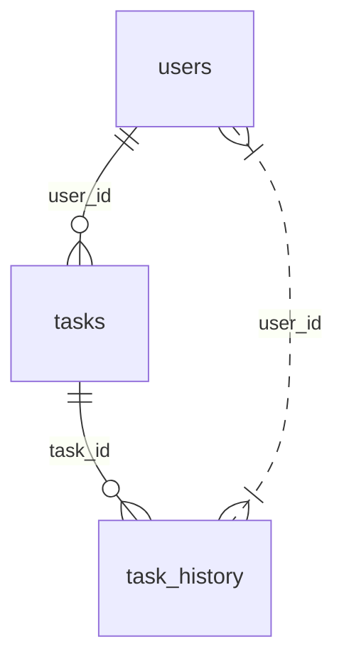

## Database Schema
```sql
CREATE TABLE users (
    id INTEGER PRIMARY KEY,
    username TEXT NOT NULL,
    password TEXT NOT NULL,
    role TEXT NOT NULL
);

CREATE TABLE tasks (
    id INTEGER PRIMARY KEY,
    title TEXT NOT NULL,
    description TEXT NOT NULL,
    status TEXT NOT NULL,
    priority TEXT NOT NULL,
    due_date DATE NOT NULL,
    user_id INTEGER NOT NULL,
    FOREIGN KEY (user_id) REFERENCES users (id)
);

CREATE TABLE task_history (
    id INTEGER PRIMARY KEY,
    task_id INTEGER NOT NULL,
    status TEXT NOT NULL,
    updated_at TIMESTAMP NOT NULL,
    FOREIGN KEY (task_id) REFERENCES tasks (id)
);
```

## File Structure
```python
main.py (Streamlit app entry point)
auth.py (user authentication and authorization)
tasks.py (task CRUD operations)
users.py (user profile management)
reporting.py (basic reporting and analytics)
models.py (database models)
database.py (SQLite database connection)
utils.py (utility functions)
config.py (configuration settings)
requirements.txt (dependencies)
```

## Mermaid Diagram
